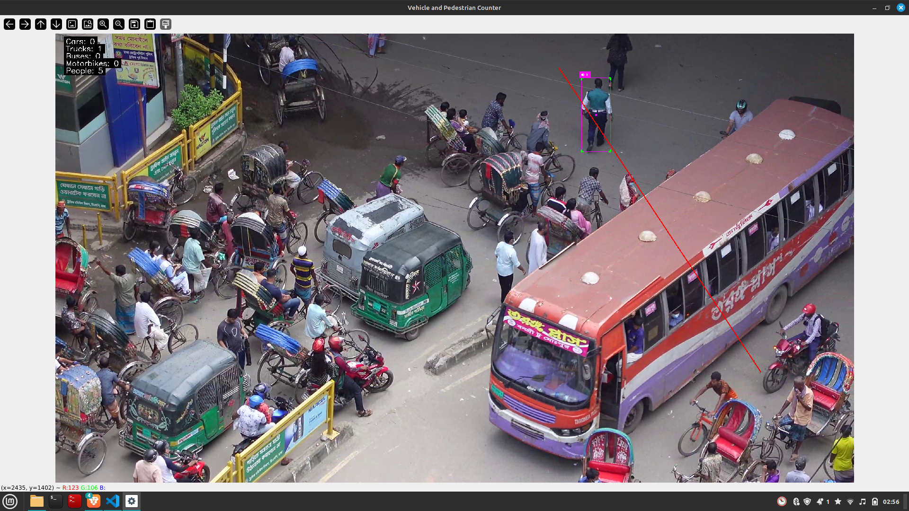

# Indian Urban Traffic Vehicle and Pedestrian Counter
## Features:
1. Detects and counts **cars**, **buses**, **trucks**, **motorcycles**, and **pedestrians** in Indian urban traffic videos using YOLOv8 and SORT tracker.
2. Create masks (region of interest (ROI) filter that defines which areas of the video frame should be analyzed for object detection and counting) for different videos. 

## Requirements

```bash
ultralytics
opencv-python 
cvzone 
numpy
filterpy
imageio
lap
```

##  Setup

```bash
pip install -r requirements.txt
```

## Run script
### vehicle_pedestrian_counter
``` bash
python vehicle_pedestrian_counter.py \
  --source sample_videos/<your video_name here; default is demo.mp4>.mp4 \
  --weights Yolo-Weights/yolov8n.pt \
  --mask custom_mask.png \
  --output counts.csv
```
### create_mask
```bash
# Create mask for a video file
python create_mask.py --video sample_videos/demo.mp4

# Specify custom output directory
python create_mask.py --video sample_videos/demo.mp4 --output custom_masks/

# Start from a specific frame
python create_mask.py --video sample_videos/demo.mp4 --frame 100
```

## Project structure
```
Basic-Vehicle-and-Pedestrian-Counter-from-Video/
├── mask.png                         # Region of interest image
├── sort.py                          # SORT tracker logic
├── vehicle_pedestrian_counter.py    # Main script with counter logic
├── create_mask.py                   # Create custom masks for different videos
├── requirements.txt                 # Python dependencies
├── counts.csv                       # Output file (generated after run)
├── sample_videos/
│   └── cars.mp4                     # Place your input videos here
├── masks/
│   └── your_mask.png   
├── Yolo-Weights/
│   └── yolov8n.pt                   # Pretrained Ultralytics YOLOv8 model
├── README.md                        # Project description & usage
└── output/                          # Folder to store screenshots/demos
```
### Demo
